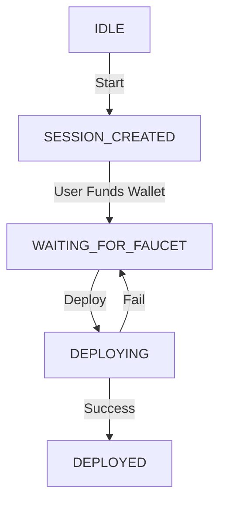

# 🚀 Devnet Playground API Documentation

This API powers a **Devnet Simulation Playground** where users can:
- Generate a temporary developer wallet
- Fund it via a faucet
- Deploy a smart contract
- View the deployed contract on a blockchain explorer

> ⚠️ **DEVNET ONLY**  
> Wallets and private keys are generated for educational and testing purposes only.  
> **Never use this system on mainnet.**

---

## 🌐 Base URL

```text
http://75.119.155.222:3000
```

### Standard Response Format

**✅ Success:**
```json
{
  "success": true,
  "data": {
    ...
  }
}
```

**❌ Error:**
```json
{
  "success": false,
  "error": {
    "code": "ERROR_CODE",
    "message": "Human-readable explanation"
  }
}
```

---

## 🛠️ Endpoints

### 1️⃣ Start Session / Generate Wallet

Generates a new temporary developer wallet and creates a session.

- **URL:** `/api/start`
- **Method:** `POST`
- **Body:** `None`

**✅ Success Response:**
```json
{
  "success": true,
  "data": {
    "sessionId": "550e8400-e29b-41d4-a716-446655440000",
    "walletAddress": "0x9EAb89989d22D44cBcd0b490a531d197C36b4AEb",
    "privateKey": "0xe938f227...",
    "faucet": "https://faucet-2.seismicdev.net/"
  }
}
```

| Field | Description |
| :--- | :--- |
| `sessionId` | Temporary session identifier |
| `walletAddress` | Generated dev wallet address |
| `privateKey` | Wallet private key (**DEVNET ONLY**) |
| `faucet` | Faucet URL to fund the wallet |

**❌ Error Response:**
```json
{
  "success": false,
  "error": {
    "code": "WALLET_GEN_FAILED",
    "message": "Failed to generate wallet"
  }
}
```

---

### 2️⃣ Deploy Contract

Deploys the smart contract using the wallet generated in the start session step.

> ⚠️ **Note:** The wallet must be funded via faucet before calling this endpoint.

- **URL:** `/api/deploy`
- **Method:** `POST`

**Request Body:**
```json
{
  "sessionId": "550e8400-e29b-41d4-a716-446655440000"
}
```

**✅ Success Response:**
```json
{
  "success": true,
  "data": {
    "walletAddress": "0x9EAb89989d22D44cBcd0b490a531d197C36b4AEb",
    "contractAddress": "0xABC123...",
    "contractLink": "https://explorer.seismicdev.net/address/0xABC123..."
  }
}
```

| Field | Description |
| :--- | :--- |
| `walletAddress` | Wallet used for deployment |
| `contractAddress` | Deployed smart contract address |
| `contractLink` | Explorer link to the deployed contract |

**❌ Error Responses:**

**Session Not Found:**
```json
{
  "success": false,
  "error": {
    "code": "SESSION_NOT_FOUND",
    "message": "Session not found or expired"
  }
}
```

**Deployment Failed:**
```json
{
  "success": false,
  "error": {
    "code": "DEPLOY_FAILED",
    "message": "Contract deployment failed. Check server logs."
  }
}
```

---

## 🌐 Web / Frontend Flow

This section describes how a frontend website should interact with the API.

### 🧑‍💻 User Journey

#### 🟢 Step 1 — Start Simulation
1. **User** clicks `Start Devnet Simulation`.
2. **Frontend** calls `POST /api/start`.
3. **Frontend** stores `sessionId`.
4. **Frontend** displays wallet address, private key, and faucet link.

#### 🟡 Step 2 — Fund Wallet
1. **User** opens the faucet link.
2. **User** extracts the wallet address.
3. **User** submits the faucet transaction.
4. **Frontend** shows "Waiting for funds..." (and optionally allows retry).

#### 🔵 Step 3 — Deploy Contract
1. **User** clicks `Deploy Contract`.
2. **Frontend** calls `POST /api/deploy` with `sessionId`.
3. **Frontend** shows loading state.

#### 🟣 Step 4 — View Contract
1. **On Success**, **Frontend** displays deployed contract address.
2. **Frontend** provides an explorer link.
3. **User** clicks to inspect the contract.

### 🔄 State Machine


